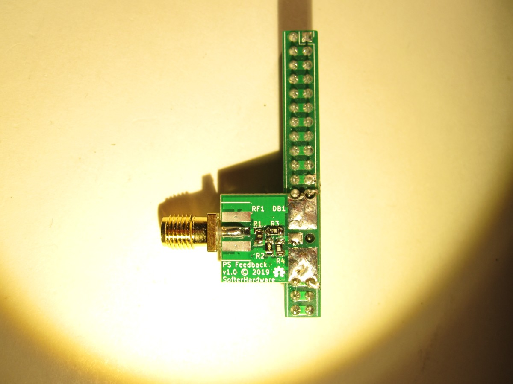

# BOM

The BOM below lists possible options for PureSignal feedback board. The builder should choose what components they need to buy and install.

| Reference | Quantity | Component |
| --------- | -------- | --------- |
| RF1 | 1 | [Edge Launch SMA](https://www.digikey.com/product-detail/en/adam-tech/RF2-04A-T-00-50-G/2057-RF2-04A-T-00-50-G-ND) |
| R1 | 1 | [0Ohm 0805](https://www.digikey.com/product-detail/en/yageo/RC0805JR-070RL/311-0.0ARCT-ND) |
| R2 | 1 | [49.9 0805](https://www.digikey.com/product-detail/en/yageo/RC0805FR-0749R9L/311-49.9CRCT-ND) |
| R3 | 1 | [470 0805](https://www.digikey.com/product-detail/en/yageo/RC0805FR-07470RL/311-470CRCT-ND) |
| R4 | 1 | [1K 0805](https://www.digikey.com/product-detail/en/yageo/RC0805FR-071KL/311-1.00KCRCT-ND) |

# Assembly

Please refer to the [schematic](db9.pdf) during assembly. 

Below is a picture of an assembled PureSignal feedback board soldered on to the HL2/N2ADR jumper board. The components installed are as per the schematic, but experimentation may be necessary to determine the best values. The PCB supports pi and t attenuator configurations. 
[Pi Calculator](https://chemandy.com/calculators/matching-pi-attenuator-calculator.htm)
[T Calculator](https://chemandy.com/calculators/matching-t-attenuator-calculator.htm)

Note that the PCB only connects to one pin on the HL2/N2ADR jumper board. This is so that the connection between the two pins on the HL2/N2ADR jumper board can be drilled open so that less "wire" is hanging off of this line. This can only be done if the feedback board is installed so that it hangs out towards T3. If installed to hang out towards the N2ADR board, then the two pins on the HL2/N2ADR jumper board must remain connected.

