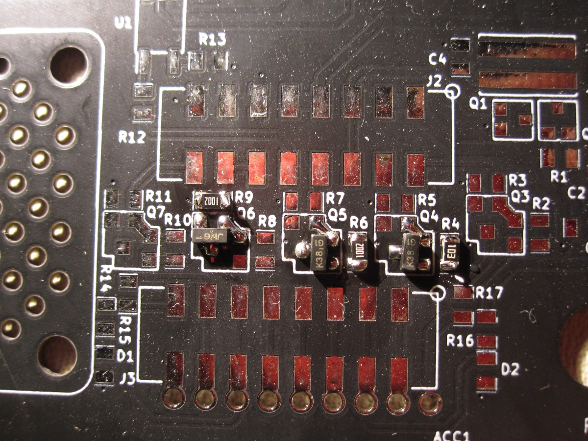
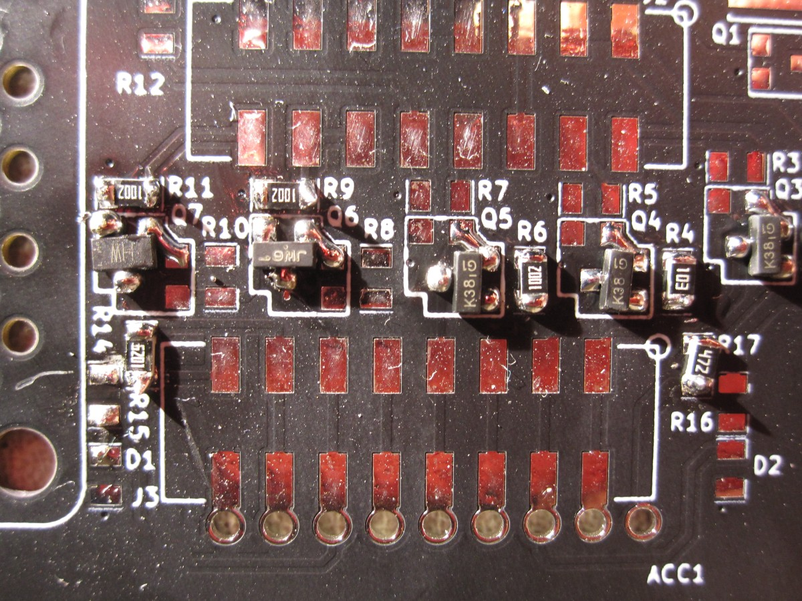
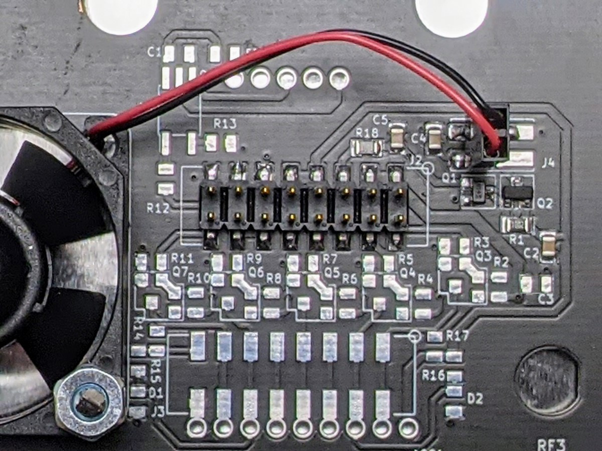
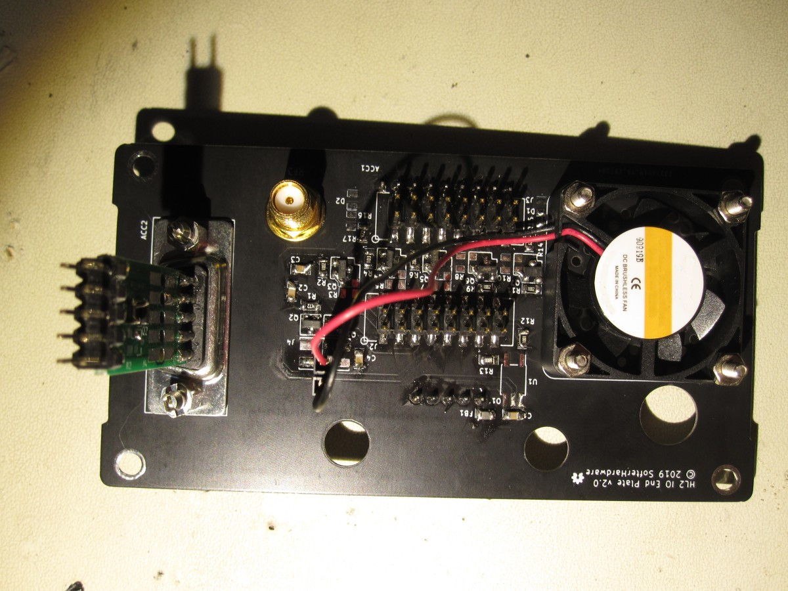
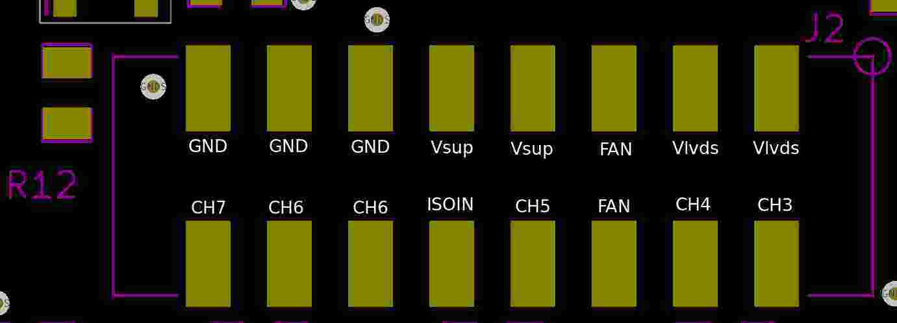
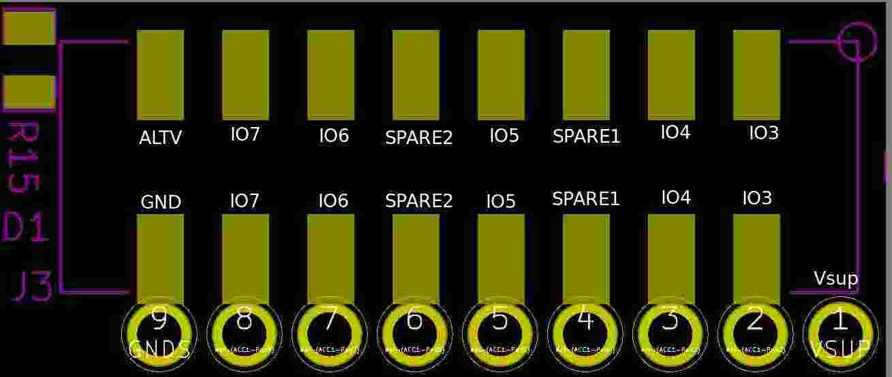
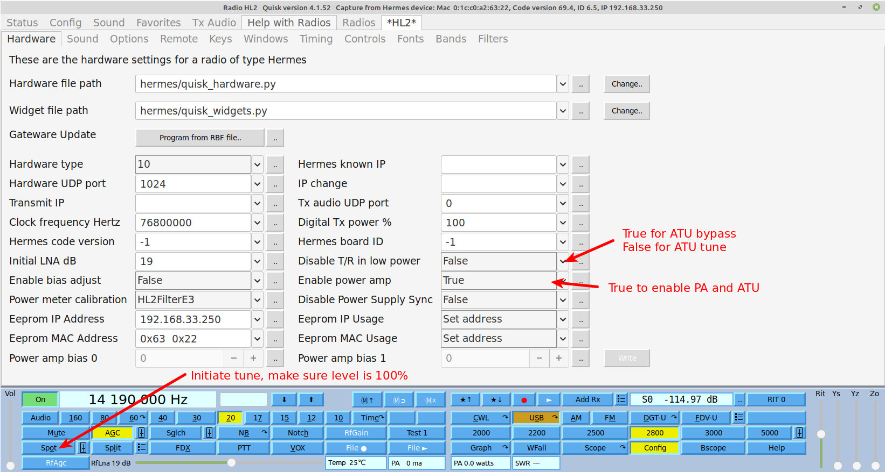
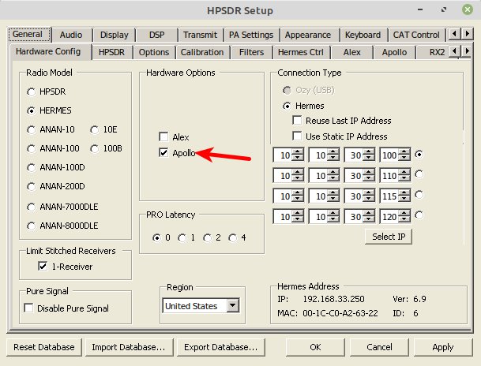
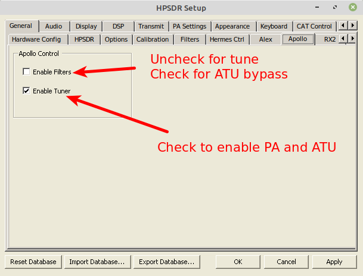
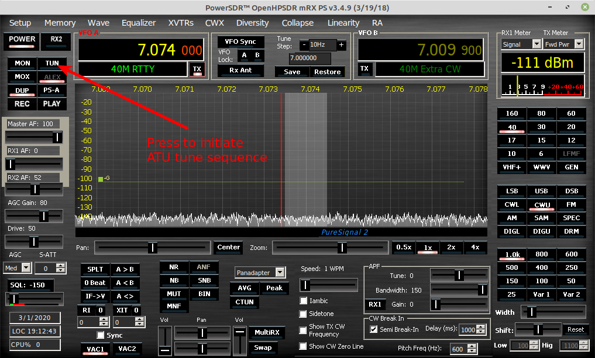

# BOM

The BOM below lists possible options for the IO end plate. The builder should choose what components they need to buy and install.


| Reference | Quantity | Component |
| --------- | -------- | --------- |
| ACC1 | 1 | [9-pin 2.54mm spacing](https://www.adafruit.com/product/2134) |
| | | [9-pin 2.54mm spacing](https://www.digikey.com/product-detail/en/adafruit-industries-llc/2134/1528-1973-ND/6827099) |
| | | [5-pin 5.08mm spacing](https://www.digikey.com/product-detail/en/adam-tech/EB21A-05-D/2057-EB21A-05-D-ND/9830743) |
| ACC2 | 1 | [DB-9 male](https://www.digikey.com/product-detail/en/edac-inc/627-009-220-047/151-1197-ND/1298747) |
| RF1 | 1| [SMA panel mount](https://www.digikey.com/products/en?keywords=CONREVSMA004-G-ND) |
| ISO1 | 1 | [5-pin 2.54mm spacing](https://www.adafruit.com/product/2139) |
| | | [5-pin 2.54mm spacing](https://www.digikey.com/product-detail/en/adafruit-industries-llc/2139/1528-1975-ND/6827102) |
| | | [3-pin 5.08mm spacing](https://www.digikey.com/product-detail/en/adam-tech/EB147A-03-D/2057-EB147A-03-D-ND/9830884) |
| J2, J3 | 2 | [8x2 SMT 2.54mm header](https://www.digikey.com/products/en?keywords=609-6422-ND) |
| J4 | 2 | [2x1 SMT 2.54mm header](https://www.digikey.com/product-detail/en/amphenol-icc-fci/54201-G0802ALF/609-6449-1-ND/9653772) |
| U1 | 1 | [ACPL-M61M-500E 2.5-3.3V](https://www.digikey.com/products/en?keywords=ACPL-M61M-500E) |
| | | [ACPL-M21L-000E 5V](https://www.digikey.com/products/en?keywords=acpl-m21l-000e) |
| Q1 | 1 | [DTC144E](https://www.digikey.com/products/en?keywords=ddtc144tuadict-nd) |
| Q2 | 1 | [IRLM6402](https://www.digikey.com/products/en?keywords=irlml6402pbfct-nd) |
| Q3A-Q7A | max 5 | [NUD3124](https://www.digikey.com/product-detail/en/on-semiconductor/NUD3124LT1G/NUD3124LT1GOSCT-ND/920232) |
| | | [RQ5E030AJ](https://www.digikey.com/product-detail/en/rohm-semiconductor/RQ5E030AJTCL/RQ5E030AJTCLCT-ND/6573132) |
| Q3B-Q7B | max 5 | [BSS138](https://www.digikey.com/product-detail/en/micro-commercial-co/BSS138W-TP/BSS138W-TPMSCT-ND/6616168) |
| R1-R17 | 1-8 | [10K 0805](https://www.digikey.com/product-detail/en/yageo/RC0805FR-0710KL/311-10.0KCRCT-ND/730482) |
| R12 | 1 | [1K 0805](https://www.digikey.com/product-detail/en/yageo/RC0805FR-071KL/311-1.00KCRCT-ND/730391) |
| R13 | 1 | [680 0805](https://www.digikey.com/product-detail/en/yageo/RC0805FR-07680RL/311-680CRCT-ND/731048) |
| C1-C4 | 4 | [0.1uF 0805](https://www.digikey.com/product-detail/en/kemet/C0805C104Z5VACTU/399-1177-1-ND/411452) |
| D1, D2 | 2 | [1N4148](https://www.digikey.com/product-detail/en/micro-commercial-co/1N4148W-TP/1N4148WTPMSCT-ND/717311) |
| FB1 | 1 | [0805 Power Line](https://www.digikey.com/product-detail/en/laird-signal-integrity-products/HI0805R800R-10/240-2395-1-ND/806755) |


# Assembly

Please refer to the [schematic](endcap.pdf) during assembly. 

## IO Channels 

There are 5 general purpose IO channels that may be populated on the end plate. Each channel can be configured as a voltage level shifter or generic output. Below is a picture with three channels populated for the inner 3 pins of a 5 pin terminal block. Note the orientation of the transistors. Two channels (Q4,Q5) are configured with BSS138 MOSFETs for bidirectional level shifting. One channel (Q6) is configured with a NUD3124 as an output for an inductive load such as a relay.



In the picture below, the remaining 2 channels are populated. These are only available if a 9-pin terminal block or 9-pin header is used. Q3 is configured as another bidirectional level shifting channel. Q7 uses the RQ5E030AJ device for small signal output. 


The two outermost channels have footprints for optional pullup resistors. In the picture below, these are populated for Q7 and Q3 channels for testing. Optional pullup resistors and protection diodes are also available for channels Q4 and Q6. Channel Q5 has no options. 

Note in the schematic that channels Q3 and Q4 pullup resistors are hardwired to Vsup which is usually +12V. This is to interface with the Icom AH-4 ATU which uses +12V IO. Channels Q6 and Q7 pullup resistors are not hardwired to any voltage. Instead, the desired voltage must be connected to pin 15 on header J3. 



For Icom AH-4 ATU use, it is recommended that two bidirectional IO channels are populated for Q4 and Q6 that connect to the 5-pin terminal block. No pullup resistors should be used. The outermost pins of the 5-pin terminal block are Vsup (usually +12V) and Ground. The middle pin is an unused option for ATU use.

## Fan Active Components

Below is a picture of assembled fan control components. Note that a 2 pin header is installed for J4. That pads of J4 are large enough that the fan wires can be soldered directly to the PCB. Also, it may be found necessary to solder a larger capacitor to J4 to smooth out the PWM-generated voltage. The J4 pin/pad farthest from Q1 is ground.



The fan algorithm in the HL2 behaves as follows. When the HL2 is first powered on, the fan will briefly turn on. This helps verify that the fan is working.

 * Low speed turns on at 35C, off at 30C
 * Medium speed turns on at 40C, back to low speed at 35C
 * Full speed turns on at 45C, back to medium speed at 40C
 * TX disabled at 55C, enabled at 50C or by power cycling the unit

## Surface Mount Headers

Below is a picture with the surface mount headers installed. J2 provides connection for power and signals from the HL2. J3 provides extra connectivity for output signals in case they must be used elsewhere.


## Completed 

Below is an inside view of the completed end plate. The fan, DB9, and PureSignal feedback are installed.



## J2 Connection Diagram



## J3 Connection Diagram



# ATU

Gateware 69.4 and later support the Icom AH-4 tuner. Other AH-4 compatible tuners may work. These include the Icom AH-3, AH-2, LDG IT-100 and mAT-180H. See [AH-4 Design and Operation](https://hamoperator.com/HF/AH-4_Design_and_Operation.pdf) as well as the [AH-4 Service Manual](https://www.manualslib.com/manual/822386/Icom-Ah-4.html) for more details.

## ATU Wiring

For pin information, see [Rear IO strip](https://github.com/softerhardware/Hermes-Lite2/wiki/IO#rear-io-strip-diagram), [HL2 IO](https://github.com/softerhardware/Hermes-Lite2/wiki/IO) and [J2 Connection Diagram](https://github.com/softerhardware/Hermes-Lite2/tree/master/hardware/enclosure/endcaps/kf7o/hl2_40b#j2-connection-diagram).

| HL2 to IO Endplate | IO Endplate Components | IO Endplate to AH-4 |
| ------------------ | ---------------------- | ------------------- |
| DB1-5 ATU_ACK to J2-4 CH4 | Q4B, R4, R16 | ACC1-3 to Green KEY |
| DB1-6 ATU_REQ to J2-14 CH6 | Q6B, R8 | ACC1-7 to White START |
| DB1-8 Vlvds to J2-1 Vlvds | | |
| DB1-14 GND to J2-15 GND | | |
| Rear IO Vsup to J2-7 Vsup | | ACC1-1 to Red Power |
| Rear IO GND to J2-11 GND | | ACC1-9 to Black Ground |

 * Two grounds are connected to avoid loops.
 * To reduce RF noise and pickup on the KEY and START wires, you can install 0.1 uF capacitors at IO Endplate footprints D1 and D2.
 * Only odd pins are used on ACC1 so that they will match to the 5 pins of a terminal block if installed at position ACC1.
 * If you do not see the expected idle voltages on ACC1-3 or ACC1-7, replace the BSS138 on the respective channel.

 | Pin | Expected Idle Voltage |
 | --- | --------------------- |
 | DB1-5 | 2.5V |
 | DB1-6 | 2.5V |
 | DB1-8 | 2.5V |
 | DB1-14 | 0V |
 | ACC1-1 | 12V |
 | ACC1-3 | ACC1-1 +/- 0.5V |
 | ACC1-7 | 5V |
 | ACC1-9 | 0V |

## Operation

The ATU tune function will activate if the TUNE request bit is set during transmit. See the [protocol wiki](https://github.com/softerhardware/Hermes-Lite2/wiki/Protocol) for details. The PA must be on (ATU functionality is not available during low power out) and power out must be 5W to activate the tuner. The 'Enable Filters' checkbox (PowerSDR) or 'Disable T/R in low power' selection (Quisk) selects between tune or bypass. Currently there is no way to force retune of a specific frequency (reset memory setting) as this does not appear to be supported by the AH-4 protocol. To erase all memorized settings, you must remove power from the AH-4 and wait for a capacitor to discharge. My unit took more than 12 hours to discharge. You can also open the unit and quickly discharge the processor's 5V supply with a wire.

Pressing tune in PowerSDR or Spot in Quisk (with code modifications) will activate the tuner. You will hear relays click in the ATU if nearby. A successful tune will end after 2-4 seconds and the tune signal will still be transmitting as seen with duplex enabled. You can confirm a low SWR with Quisk. An unsuccessful tune will end in 2-4 seconds but the tune signal will not be transmitting.

Initiating tune in bypass mode will always result in success but no matching network will be inserted by the AH-4.

If you do not have an ATU and press the tune or spot button, a signal will be generated as expected, but may be delayed by up to 0.5 seconds as the HL2 discovers there is no ATU. To reduce this time, enable bypass mode by checking the 'Disable T/R in low power' or the 'Enable Filters' checkbox.

### Quisk

Until official support is added to Quisk, you must add code to set the TUNE request bit when spot is pressed. Replace the OnSpot method in hermes/quisk_hardware.py with the following:

```python
  def OnSpot(self, level):
    print("OnSpot",level)
    # level is -1 for Spot button Off; else the Spot level 0 to 1000.
    if level > 0:
      self.pc2hermes[4 * 9 + 1] |= 0x10
    else:
      self.pc2hermes[4 * 9 + 1] &= ~0x10
    QS.pc_to_hermes(self.pc2hermes)
```




### PowerSDR







